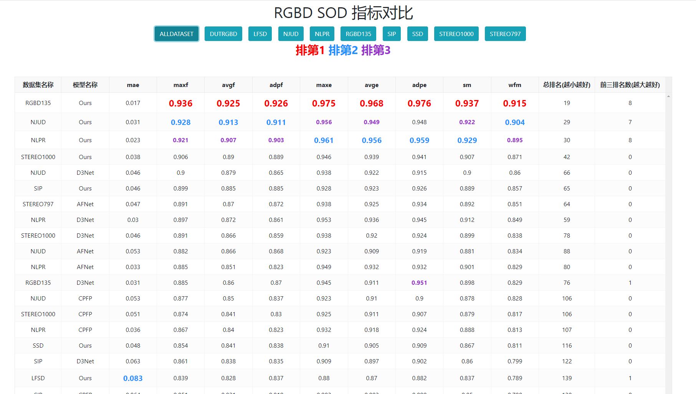

# 基于python的显著性目标检测测评工具箱
A Python-based **RGB/Co-RGB/RGB-D** salient object detection evaluation toolbox.

tips:本项目改编自https://github.com/lartpang/PySODEvalToolkit <br>
本项目改编的目的是为了更方便我自己使用，下面是简要使用步骤，如有不了解的，可以直接发Issue或者邮件1677688026@qq.com
#改编地方
1. 改编了配置文件等相关，更方便我自己使用
2. 增加了NJUD多个数据集版本之间的直接合并，可能也只有我自己知道是什么意思
3. 增加了将npy文件转换为可视化html页面，更加方便的查看指标排名，如下图，可直接查看指标的排名名次等信息

# 使用步骤
1. 先配置文件
配置好`config/config_method_ours.py``config_method_others.py``config_dataset.py`
2. 转换配置文件
使用`pyconfig_to_jsonconfig.py`将配置文件转换为`json/config_dataset.json``json/config_method_others.json ``json/config_method_ours.json`
3. 检查转换后的配置文件是否有错误
使用`tools/check_path.py`检查是否有转换错误
4. 计算数据
使用`eval.py`计算数据，数据会被自动保存到npy文件中
5. 根据计算得到的数据，绘制可视化网页
使用`tools/npy_to_htmls2.py`将npy转为可视化的html页面
6. 根据计算得到的数据，绘制可视化图片
使用`plot.py`将npy文件绘制成图片的形式


## TODO

* [x] 更灵活的绘图配置脚本（支持使用[符合matplotlib要求的](https://matplotlib.org/stable/tutorials/introductory/customizing.html#the-default-matplotlibrc-file)yaml文件来对绘图格式进行配置）
* [ ] 添加测试脚本
* [ ] 添加更详细的注释
* [ ] 考虑是否要使用yaml来替换配置策略。其支持注释操作，功能更丰富，相比json更加灵活
* [ ] 优化xlsx导出的代码(? 导出CSV或许更好些? 既可以当做文本文件打开, 亦可使用Excel来进行整理)
* [x] 多进程和多线程的支持.
* [X] 剥离USVOS部分的代码, 让本仓库更专注一些, 相关代码已转移到另一个仓库[PyDavis16EvalToolbox](https://github.com/lartpang/PyDavis16EvalToolbox).
* [X] 提供对输出的结果基于某个指标进行排序的功能的支持(即, 使表格更加直观), 将会在接下来的版本中添加github-page来展示动态页面.
* [X] 基于Fan的matlab代码, 我实现了一份更加快速和准确的指标代码<https://github.com/lartpang/PySODMetrics>, 已经整合到该代码中.

## 特性

* 提供11项显著性目标检测指标的评估
    - F-measure-Threshold Curve
    - Precision-Recall Curve
    - MAE
    - weighted F-measure
    - S-measure
    - max/average/adaptive F-measure
    - max/average/adaptive E-measure
* 额外提供针对部分医学二值分割任务使用的数个指标的支持
    - max/average Precision
    - max/average Sensitivity
    - max/average Specificity
    - max/average F-measure
    - max/average Dice
    - max/average IoU
* 测试代码高度优化
    - 纯python实现, 基于numpy和各种小trick计算各项指标, 速度有保障
    - 导出特定模型的结果到xlsx文件中（2021年01月04日重新提供支持）
    - 直接支持从生成的npy文件导出latex表格代码，顺便还可以对前三的方法使用不同颜色进行标记。
    - 导出测试结果到txt文件中
    - 评估所有指定的方法, 根据评估结果绘制PR曲线和F-measure曲线

## 使用方法

由于对于数据集和方法的配置因用户而异, 所以在<https://github.com/lartpang/Py-SOD-VOS-EvalToolkit/commit/d7bcc1d74065844fe0483dc3ce3fda7d06d07bc0>
之后的版本不在更新 `configs` 文件夹中的这部分内容, 直接给出一些简单的例子, 用户可以自行修改.

配置文件的例子:
* python版本, 书写方便, 可以使用IDE的特性, 可以注释, 只需满足python语法. 但是需使用转换脚本进行转换.
    + 可以参考 `examples` 文件夹中的 ~~`dataset_config.py` 和 `method_config.py`~~ `config_dataset_py_example.py` 和 `config_method_py_example.py`.
* json版本, 更直接, 但是可能需要特定的插件支持. 需要满足json的语法. 不可以使用注释和末尾的逗号.
    + 可以参考`examples`文件夹中的 `config_dataset_json_example.json` 和 `config_method_json_example.json`.

具体使用流程（更新于2022年4月24日）:
1. 先安装指标代码库： `pip install pysodmetrics`.
    - 评估代码来自本人的另一个项目：<https://github.com/lartpang/PySODMetrics>, 欢迎捉BUG！
2. 配置不同数据集以及方法的路径信息：
    - 本项目依赖于json文件存放数据.
    - 但是本项目提供了`tools/info_py_to_json.py`来将python格式的信息转换为json文件. 使用方法可见`tools/readme.md`.
    - 准备好json文件后, 建议使用提供的`tools/check_path.py`来检查下路径信息是否正常.
    - **请务必确保*数据集字典的名字*和方法中配置不同*数据集字典的名字*一致**.
3. 一切正常后, 可以开始评估了.
    - 评估脚本用法：`python eval.py --help`
    - 根据自己需求添加配置项并执行即可。如无异常, 会生成指定文件名的结果文件。如果不指定所有的文件，那么就直接输出结果，具体可见阅读`eval_all.py`的帮助信息。
    - 如指定`--curves-npy`, 绘图的信息将会保存到对应的`.npy`文件中.
4. 后续可以使用`plot.py`来读取`.npy`文件按需对指定方法和数据集的结果整理并绘制`PR`曲线和`Fm`曲线.
    - 该脚本用法可见：`python plot.py --help`
    - 按照自己需求添加配置项并执行即可。最基本的一条是请按照子图数量合理指定配置文件中的`figure.figsize`项的数值。
5. 可选：
   1. 使用`tools/converter.py`直接从生成的npy文件中导出latex表格代码.

## 相关文献

```text
@inproceedings{Fmeasure,
    title={Frequency-tuned salient region detection},
    author={Achanta, Radhakrishna and Hemami, Sheila and Estrada, Francisco and S{\"u}sstrunk, Sabine},
    booktitle=CVPR,
    number={CONF},
    pages={1597--1604},
    year={2009}
}

@inproceedings{MAE,
    title={Saliency filters: Contrast based filtering for salient region detection},
    author={Perazzi, Federico and Kr{\"a}henb{\"u}hl, Philipp and Pritch, Yael and Hornung, Alexander},
    booktitle=CVPR,
    pages={733--740},
    year={2012}
}

@inproceedings{Smeasure,
    title={Structure-measure: A new way to eval foreground maps},
    author={Fan, Deng-Ping and Cheng, Ming-Ming and Liu, Yun and Li, Tao and Borji, Ali},
    booktitle=ICCV,
    pages={4548--4557},
    year={2017}
}

@inproceedings{Emeasure,
    title="Enhanced-alignment Measure for Binary Foreground Map Evaluation",
    author="Deng-Ping {Fan} and Cheng {Gong} and Yang {Cao} and Bo {Ren} and Ming-Ming {Cheng} and Ali {Borji}",
    booktitle=IJCAI,
    pages="698--704",
    year={2018}
}

@inproceedings{wFmeasure,
  title={How to eval foreground maps?},
  author={Margolin, Ran and Zelnik-Manor, Lihi and Tal, Ayellet},
  booktitle=CVPR,
  pages={248--255},
  year={2014}
}
```

## Some Tips

**For some methods, their results' names are not consistent with those of original datsets.**
* **NOTE**: (2021-11-18)当前同时提供了对名称前缀与后缀的支持, 所以基本不用用户自己改名字了.
* You can use the script `rename.py` in folder `tools` to modify the file names of a large number of files. **Please use with care and it is recommended to read the code carefully before use to avoid data corruption.**
* **Other useful tools**
  + Linux: `rename`
  + Windows: `Microsoft PowerToys` <https://github.com/microsoft/PowerToys>

## 编程参考

* Python_Openpyxl: <https://www.cnblogs.com/programmer-tlh/p/10461353.html>
* Python之re模块: <https://www.cnblogs.com/shenjianping/p/11647473.html>

## 更新日志

* 2022年4月23日
    - 为了便于使用和配置，对大量代码进行了调整和修改，与之前版本相比，使用上也存在部分差异。
    - 评估部分：
      - 支持多个方法的json文件同时使用评估。
      - 更新了指标统计类，便于更灵活的指定不同的指标。
      - 对一些医学二值分割的指标提供了支持。
    - 绘图部分：
      - 支持多个曲线npy文件同时用于绘图。
      - 将个性化配置尽可能独立出来，提供了独立的绘图配置文件。
      - 重构了绘图类，便于使用yaml文件对matplotlib的默认设定进行覆盖。
* 2021年11月18日
    1. 改正拼写错误，调整命名。
    2. 支持预测结果中使用名称前缀 (例子可见`examples`文件夹中的`config_method_json_example.json`)，现在搭配后缀，基本上可以应对所有可能的情形了。但是需要说明的是，目前不支持使用文件提供的映射关系，请确保预测名字中包含真值（不包含扩展名）名字。
    3. 优化了绘图中的axis的设置，由于这些设置属于非常细粒度的设定，目前暂不支持使用终端选项配置，之后可能会使用特定的配置文件，例如json等来配置相关选项。
    4. 支持绘图中使用共享的纵轴，即`sharey`，这可以用来辅助绘制独立的示例图。具体使用可见`examples`中的`plot_results.py`文件。
    5. 优化了下 `include_` 与 `exclude_` 类选项的相关函数.
    6. 添加了数据集和方法配置的json的例子。并且针对`examples`中提供的配置文件统一命名为`config_`.
    7. 绘图支持对数据名和方法名使用别名。之前都是直接从各自的 `json` 配置文件中读取键来作为绘图中显示的名字，这对于名字有特殊标记（例如名字中想补充年份或者会议名字）时的使用不太方便和灵活。所以当前支持了使用额外的 `json` 配置文件来配置映射关系。例子可见 `examples` 中的 `alias_for_plotting.json` 。
    8. 由于核心文件`eval_all.py`和`plot_results.py`的配置和调用方式发生了变化，所以为了便于大家的使用和修改，我提供了两个简单调用的`sh`文件，里面提供了这怒地各个选项的基本配置案例。linux用户可以直接使用`bash <sh_name>.sh`来执行，而windows用户麻烦些，还是自己参考着其中的配置项在终端自行配置吧！有问题欢迎提问，当然，如果大家可以提供windows直接调用的`bat`文件倒也欢迎PR哦！
* 2021年08月28日
    - 扩展`tools/converter.py`，使其支持横竖两种格式的表格, 并补充对应的文档.
* 2021年08月25日
    - 添加从生成的npy自定义导出为latex表格代码的脚本(`tools/converter.py`), 并提供了配置文件示例(`examples/converter_config.py`).
* 2021年08月24日
    - 添加多进程多线程支持, 仅支持sod、cod的代码(`metrics/cal_sod_matrics.py`), cosod的代码由于使用频率较小, 没有改写, 欢迎PR.
    - 修改对应的示例程序(`examples/eval_all.py`),
    - 其他的一些小修改.
* 2021年08月17日
    - 调整readme文档的部分内容.
    - 更新check_patch工具为命令行输入参数, 不再使用文件内编码. 并在tools文件夹中的`readme.md`文件中补充文档.
    - 在draw_curves中添加对于输入的约束和检查.
    - 使用pigar生成`requirements.txt`文件.
* 2021年06月17日
    - 修正readme.md中的关于配置文件例子的表述
    - 删除代码中python3.8+的特有语法`:=`
* 2021年06月03日
    - 调整`tools`中的文件, 并修改readme.md.
    - 在`examples`中补充了数据集配置和方法配置的python文件示例.
* 2021年05月20日
    - 添加examples文件夹, 存放一些基本的示例. 实际上到目前为止, 没必要独立出来评估单独方法的文件, 使用提供的`eval_all.py`中的`include_methods`指定特定方法即可实现目的.
    - 添加了一些工具函数, 例如用于批量重命名文件的`rename.py`, 以及用于检查json文件中路径的合法性的`check_path.py`(建议每次修改完json后, 用该工具检查下).
* 2021年04月12日
    - 移除USVOS代码到独立的仓库.
    - 移动测试结果到<./results>中, 日后会继续添加更多的模型的结果.
* 2021年03月21日
    - 正式删除需要个人定制的评估文件, ~~这部分直接会放到本仓库的Readme中的[Examples](#Examples)中, 仅供参考.（已删除, 请看最新的方式）~~
    - 将格式化输出功能调整, 直接使用包`tabulate`处理, 更加方便, 输出的格式配置更丰富, 详见<https://github.com/astanin/python-tabulate>
    - 调整原来`cal_sod_matrics`的`skipped_datasets`为:
      - `get_datasets_info`的`exclude_datasets/include_datasets`;
      - `get_methods_info`的`exclude_methods/include_methods`.
* 2021年03月14日
    - 这一版本将数据集和方法的配置方法转换为基于json文件的配置.
    - 一些配套的更改与简化.
* 2021年03月12日
    - 这一版本正式将sod的评估、绘图代码与配置分离, 主要考虑如下
        - 用户的配置是需要调整的, 这部分不适宜被git严格的监视, 也便于提交后续更新的时候, 直接忽略关于配置的更改, 即后续更新时, 用户配置部分会不再更新, 若是添加新功能, 直接调整原始的函数, 其参数默认关闭新功能, 保证用户不会受到影响.
        - sod和cosod评估方式有差异, 但是绘图方式一致, 所以现将评估绘图拆分成独立部分, 置于metrics/sod文件夹下, 之后或许或调整位置, 但这种拆分策略不变.
    - 优化了cosod的评估代码, 对sod和cosod的指标recorder部分进行了简化.
    - 不再使用独立的sod_metrics代码, 由于我已经将PySODMetrics发布到了PyPI上, 所以可以直接通过pip安装.
    - 使用添加了对于print的一个彩色增强的封装, 可见`./utils/misc.py`中的`colored_print`.
    - git不再跟踪方法配置文件和数据集配置文件, 这部分现有的作为示例, 仅供使用者独立补充和参考.
    - 修复了之前绘制Fm曲线时x的问题, 之前取反了. 详见<https://github.com/lartpang/Py-SOD-VOS-EvalToolkit/issues/2>.
